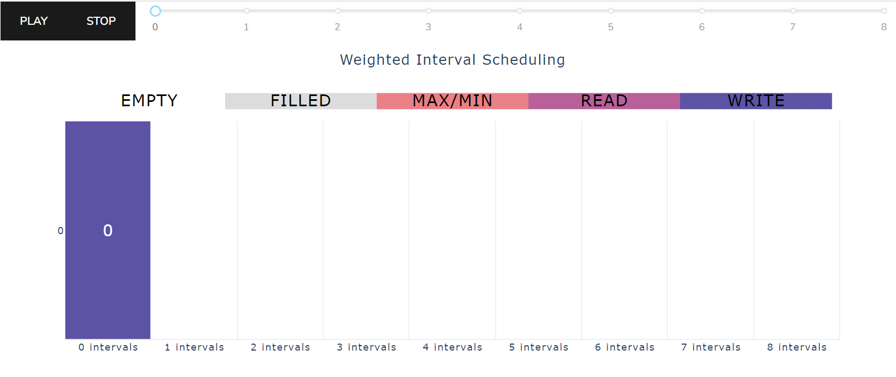
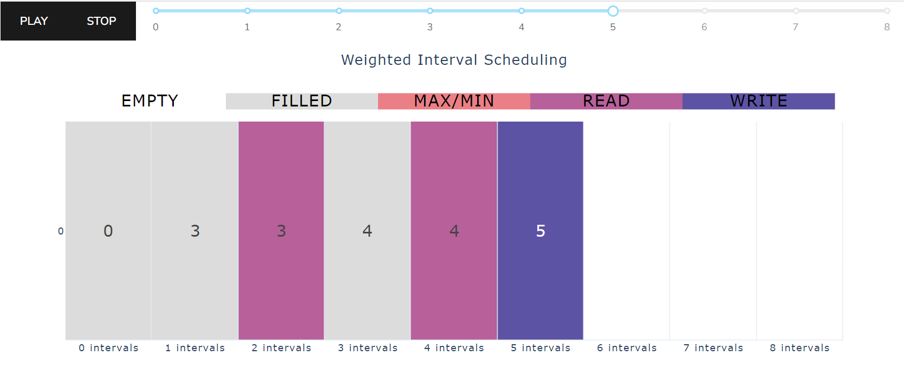

On the top of the page is a slider to control what timestep is being visualized.
The slider can be used to show different timesteps by clicking and dragging or
using the <span style="color:white;background-color:black">PLAY</span> and
<span style="color:white;background-color:black">STOP</span> buttons. Below the
slider is a visualization presenting the elements of the array on the current
timestep. The zeroth timestep shows the base case. The visualization shows that
the zeroth element of the array is set to zero, which corresponds to `OPT[0] = 0`
in our code.

Try dragging the slider to timestep 5.



Now the visual shows the array with the first six elements set. On this timestep,
elements two and four of the `OPT` array are <span style="background-color:#b7609a">READ</span>,
meaning we accessed the values of those elements on this timestep. We also 
<span style="background-color:#5c53a5">WRITE</span> a value of `5` to element
five of the `OPT` array. This corresponds to the below line in our code when `i=5`:
```
# a[2] is the weight of interval i
max(a[2] + OPT[p[i]], OPT[i - 1])
```

